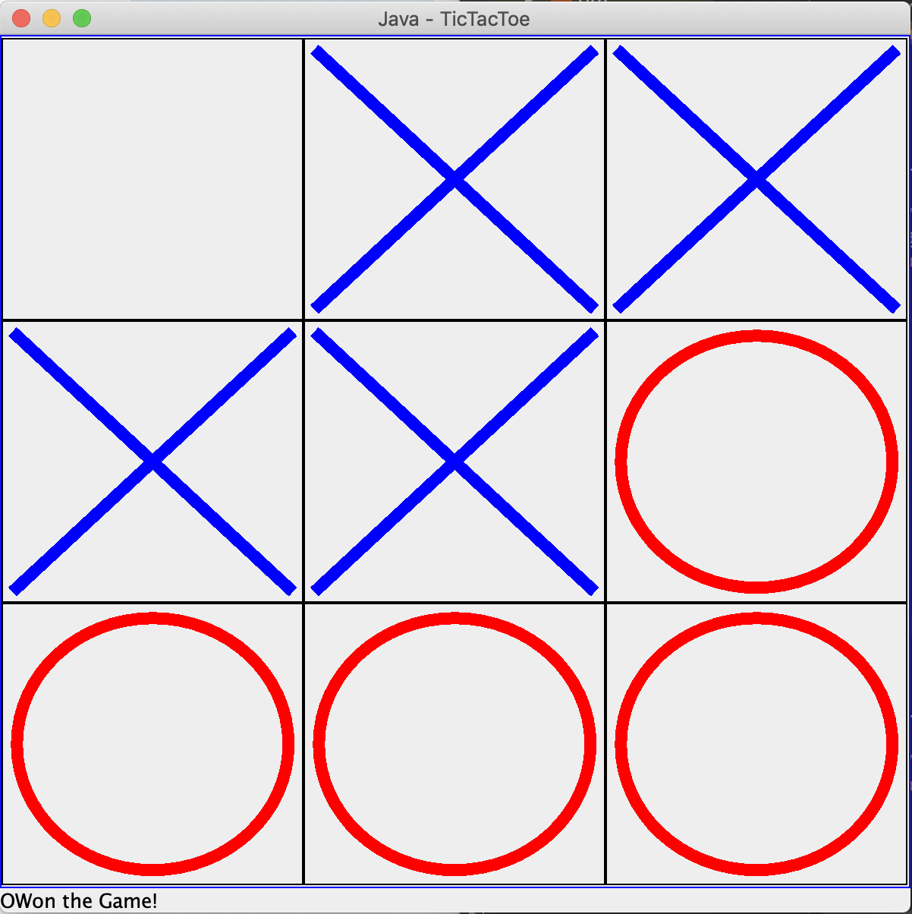

# Java TicTacToe

## Turn based TicTacToe game built on Java using Swing GUI 

    

- Mostly for practicing making interfaces with Swing.
- The core functionality is from a tutorial and a previous tictactoe game.

### Software
- **Java & Swing** to make the interface and game
- **Gradle** to run unit tests (jUnit)